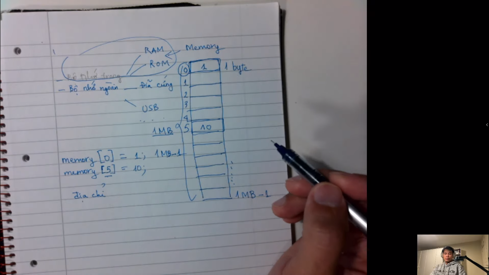
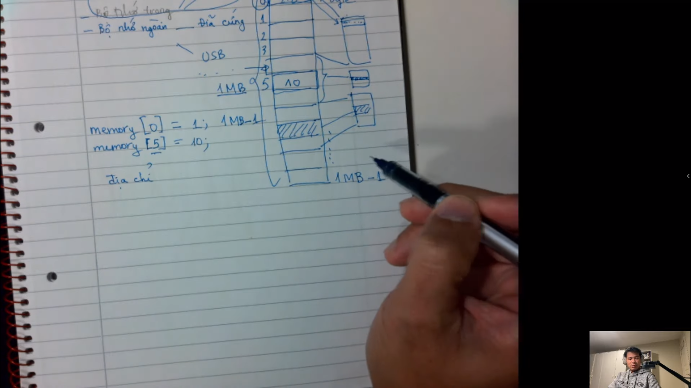
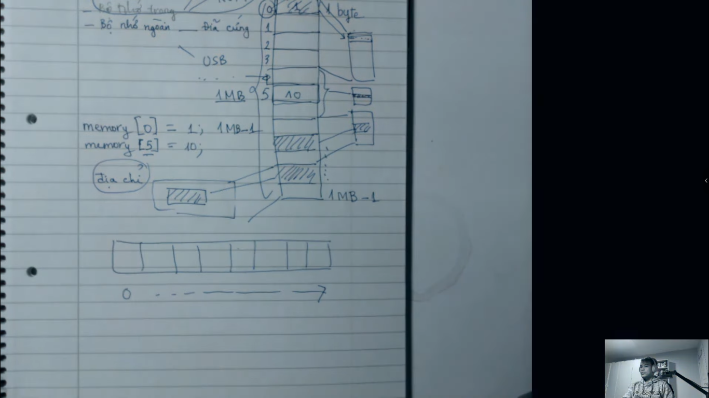
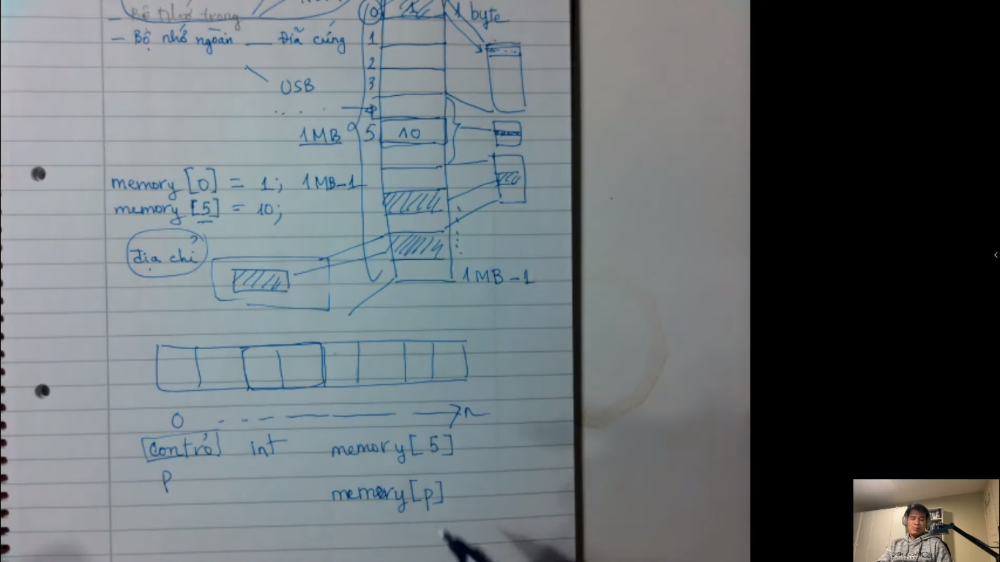
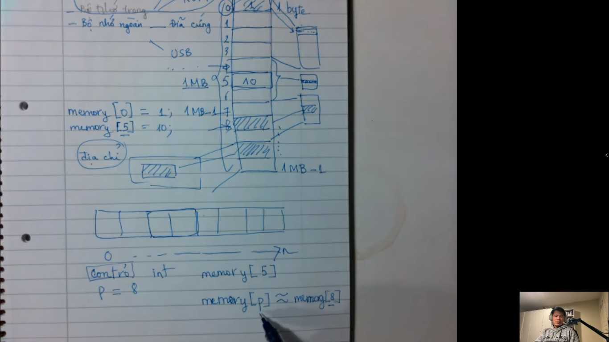
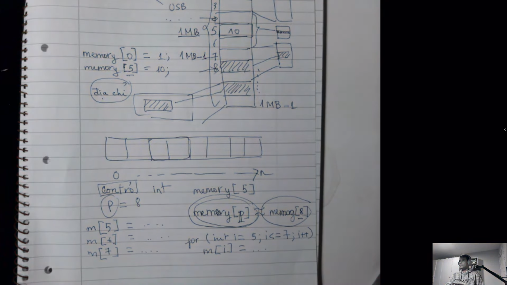
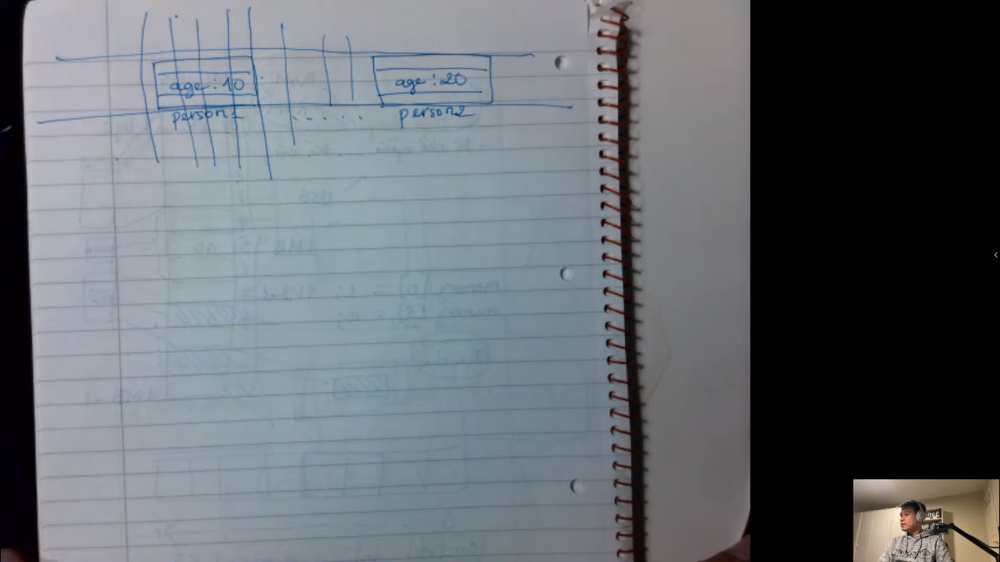
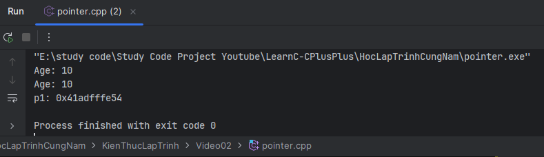
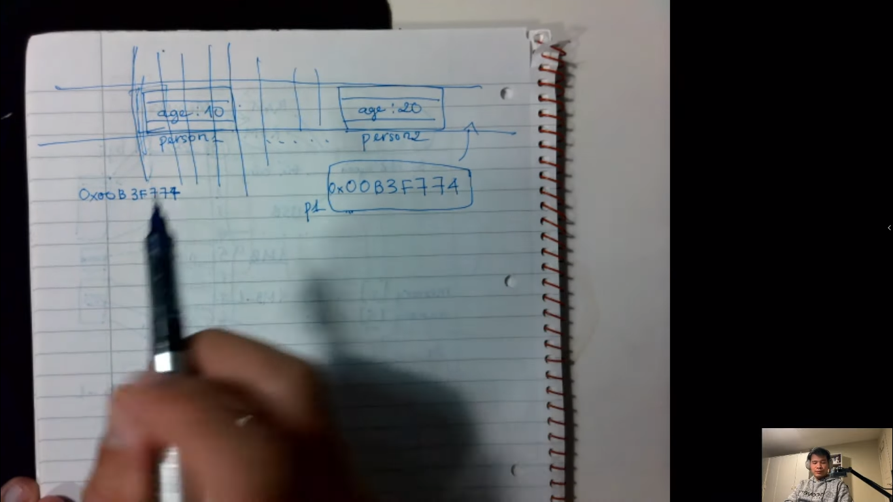
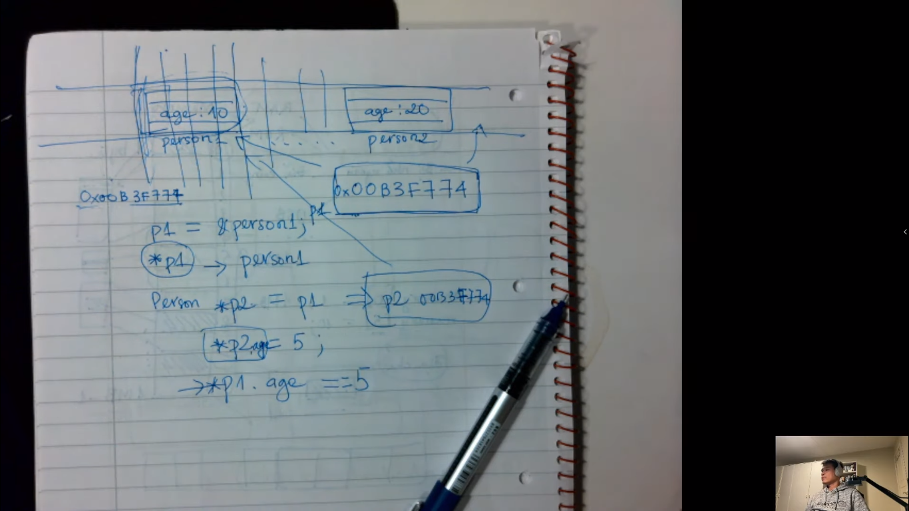

# Quản lý bộ nhớ và con trỏ

- Bộ nhớ máy tính được tổ chức như thế nào? Bản chất của con trỏ là gì?
- Hi vọng video này sẽ giải thích được cho các bạn.

_**Xem thêm bài viết về con trỏ tại đây:**_

https://daohainam.com/2021/08/13/cau-chuyen-ve-con-tro-pointer/

---

## Nội dung bài học:

Chúng ta có 2 loại bộ nhớ đó là `bộ nhớ trong` và `bộ nhớ ngoài`:

- Bộ nhớ trong có: RAM, ROM
- Bộ nhớ ngoài có: Đĩa cứng, USB
- Khi làm việc trong lập trình thì chúng ta sẽ thường xuyên học và hầu như là học về `bộ nhớ trong`
- Khi chúng ta run code thì nó sẽ quản lí bộ nhớ trong như là `memory`. Memory giống như là 1 array,
  mỗi thành phần trong đó là `1 byte`, chúng ta có 1 array là `1 MB`
- Nếu chúng ta muốn lấy giá trị trong mảng thì sẽ lấy lần lượt từ `index = 0`, sau đó `index =
  1`, và cứ đó đến hết array

> Tóm lại: bộ nhớ chúng ta là 1 mảng, mỗi thành phần trong mảng đó là 1 byte, nó sẽ được đánh số
> từ 0 cho đến n (với n có kích thước tối đa là 1 MB)

> Tất cả các byte trong bộ nhớ là duy nhất

---

- Mỗi giá trị nó sẽ được ánh xạ vào file nào đó mà được lưu trữ trên ổ đĩa bất kỳ

- Dưới đây là hình ảnh minh họa giá trị được lưu vào ổ đĩa
  

- Chỉ có hệ điều hành mới biết được chính xác giá trị ánh xạ vào đâu trong bộ nhớ RAM, hoặc hệ
  điều hành có thể thay đổi lại cái việc đó.

---

- Nhưng đứng nhìn nó với gốc độ lập trình thì mình không cần quan tâm đến việc đó. Chúng ta chỉ
  cần quan tâm dùng cái địa chỉ đó và phần bộ nhớ đó --> việc của chúng ta là đọc và ghi vào
  thôi, còn nó đi đâu thì việc của hệ điều hành nó sẽ quản lý
- Cái đơn vị quản lý bộ nhớ trong CPU và hệ điều hành cùng kết hợp với nhau và nó sẽ quyết định nó
  sẽ đi đâu và ở đâu. Cũng như khi các bạn dùng ứng dụng thì những cái phần nào nó được dùng bởi
  ứng dụng thì nó sẽ đánh dấu lại bởi hệ điều hành và hệ điều hành sẽ quản lý cái việc đó

---

- Trong thực tế thì cái việc quản lý bộ nhớ phức tạp hơn rất nhiều, nó liên quan đến môn lý
  thuyết hệ điều hành và môn kiến trúc máy tính, thì các bạn sẽ đi sâu vào cái đó. Nó là phần
  phức tạp nhất

=> Nó là phần rất là sâu, cho nên có ít người quan tâm đến cái đó

---

### Những vấn đề quan trọng nhất mà mình phải cần nhớ nè:

- Bộ nhớ được tổ chức thành 1 dãy liên tục bởi các byte, mỗi 1 byte nó sẽ được đánh địa chỉ. Địa
  chỉ đầu tiên của nó là 0, và các địa chỉ đó nó tăng dần
- Đứng từ gốc độ lập trình thì mình chỉ cần biết các địa chỉ này thôi. Thực chất ra, nó nằm ở
  đâu trong bộ nhớ thì mình không cần phải quan tâm.
- Khái niệm địa chỉ này nó rất quan trọng và chúng ta sẽ còn gặp nó rất rất nhiều đó. Địa chỉ đó
  là 1 số nguyên dương không âm
  

---

> Sau khi đã biết được khái niệm địa chỉ rồi thì chúng ta sẽ sang kiến thức khác đó là `Con Trỏ`

## Phần tìm theo là _con trỏ_

- Nếu đã biết địa chỉ là gì rồi thì kiến thức về con trỏ cực kì đơn giản
- Con trỏ là cái biến trong bộ nhớ mà giá trị của nó là 1 cái địa chỉ. Tức là nó là 1 biến bình
  thường thôi và nó nằm ở đâu đó trong bộ nhớ, nhưng mà giá trị chứa trong nó đó là 1 con số từ
  0 đến n (con số đó là 1 cái địa chỉ nào đó trong bộ nhớ)
- Bởi vì chúng ta có địa chỉ là 1 số nguyên không âm (16-bit, 32-bit,...). Cho nên 1 con trỏ
  cũng có kiểu như vậy đó (cũng là 1 số nguyên không âm)
- Mình sẽ truy cập vào nơi nào đó trong bộ nhớ thông qua 1 cái biến con trỏ
- Ví dụ: tôi lấy cái memory thứ 5 trong bộ nhớ, thay vì mình nó lấy số 5 thì mình lại nói như
  này: --> Tôi lấy cái memory thứ p trong bộ nhớ
  
- Thay vì mình đưa ra 1 con số cụ thể thì mình sẽ đưa vào con số, mà con số đó người ta gọi là
  con trỏ. Thực ra nó chỉ là cái biến, nó chứa cái ô mà mình muốn lấy
- Khi p = 8 thì tức là mình truy cập đến cái ô trong bộ nhớ là 8
  
- Tại sao mình không viết là 8 lun mà mình phải viết là p? Tại vì bộ nhớ là cái dạng như vậy,
  nhưng chỉ có hệ điều hành nó quản lý mọi thứ và chúng ta sẽ không biết được vùng nào trống và
  vùng nào không.
- Khi chúng ta cấp phát 1 cái vùng nhớ, thì vùng nhớ đó nó có thể nằm bất kỳ ở vị trí nào. Chúng
  ta sẽ không biết trước được cái vùng nhớ nào
- Chúng ta sẽ cấp phát ở đâu và sẽ dùng ở đó, thay vì dùng 1 cái giá trị cụ thể

- 🎯 Khi chúng ta học qua cấu trúc dữ liệu và thuật toán thì lúc đó chúng ta mới biết tại sao lại
  cần những thứ này, và vì sao lại cần con trỏ, mình có con trỏ thì sẽ rất thuận tiện như là
  (mình có thể cấp phát, giải phóng, những vùng nhớ nào mà mình không dùng tới thì mình có thể
  bỏ đi và sau đó khi cần thì mình lại cấp 1 cái vùng mới và lưu nó vào trong cái biến p ).

=> Sử
dụng như vậy nó rất là mềm dẻo

- Thay vì chúng ta tạo phẩn tử như là mỗi giá trị sẽ được gắn vào mỗi phần tử --> làm như vậy nó
  sẽ rất là lâu. Thay vào đó chúng ta sẽ dùng vòng lặp lặp qua cho nhanh

---

- Do chúng ta đang học con trỏ nên chúng ta sẽ code ngôn ngữ `C/C++`
- Nếu như chúng ta code ngôn ngữ `Java` hoặc `.NET` thì con trỏ trong những ngôn ngữ đó đã bị dấu đi
- Cái địa chỉ và con trỏ nó sẽ luôn luôn tồn tại, chỉ là ngôn ngữ những ngôn ngữ bậc cao nó sẽ
  dấu đi và làm cho ngôn ngữ sẽ được đơn giản hóa và tránh những lỗi mà chúng ta thưởng gặp phải
  khi mà sử dụng con trỏ

---

### Dưới đây là giải thích code trong file `pointer.cpp`

- biến person1 = 10
- biến person2 = 20
- 2 biến này nó chắc chắn sẽ nằm trong bộ nhớ
- và kích thước này nó chứa nhiều hơn 1 byte, do mình khai báo biến int nên kích thước của nó sẽ
  tới 4
  byte
  
- Địa chỉ của nó khi mình chạy lên là:
  
- Đây chính là giá trị chứa trong biến `p1` (0x41adfffe54), biến đó nó sẽ nằm đâu đó trong bộ
  nhớ và nó có giá trị là như này (0x41adfffe54) đó là giá trị `thập lục phân`
  
- Khi chúng ta nói đến biến `p1` là có nghĩa chúng ta đang nói đên giá trị biến `age = 20`
- Khi chúng ta nói đến biến `*p1` là có nghĩa chúng ta đang nói đến biến `age = 10`
- `p1` đang trỏ đến `person1`. Thì `*p1` chính là `person1`

- => Không có gì khó hiểu hết, đó chỉ là quy ước thôi, dấu `&` để lấy giá trị, còn dấu `*` để lấy
  giá trị tại nơi khi địa chỉ đó chứa đến
  

---

## Kết luận

- Khi nào có thời gian thì tác giả sẽ làm thêm về bộ nhớ stack và bộ nhớ heap. Đó là 2 kiến thức
  rất là quan trọng khi chúng ta code ngôn ngữ `C/C++` hoặc `.NET`