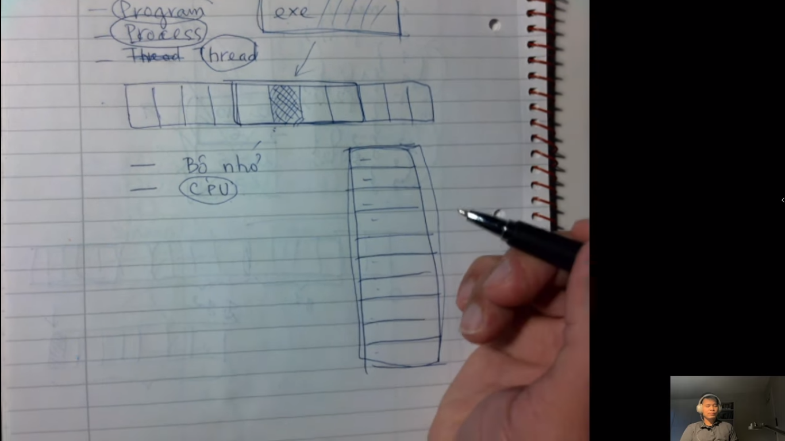

# Thread, ngắt hoạt động thế nào?

> Đây là bài học bổ sung cho kiến thức .NET, cũng như là các kiến thức căn bản và chuyên sâu về code được thực thi như
> nào trong hệ điều hành

Hôm nay chúng ta học về bài `Thread, ngắt hoạt động thế nào?
` , trong bài này gồm có:

- Process là gì? Thread là gì? Làm sao hệ điều hành lấy lại quyền kiểm soát từ một thread đang chạy?
- Phần này giới thiệu các kiến thức liên quan đến thread để các bạn nắm kiến thức nền tảng trước khi tìm hiểu về
  Async/Await

Đọc thêm tài liệu tại: https://daohainam.com/tag/multi-threading/

---

## Những hình ảnh trong bài học này được chụp từ video:

- Đây là 1 chủ đề tương đối phức tạp, nên các bạn nên nắm chắc các kiến thức nên vững chắc. Mình sẽ hướng dẫn bạn 1 cách
  từ từ cho đến khi các bạn vững những kiến thức này
- Các bạn phải hiểu về `Program`, `Process`, `Thread`,... hoạt động như thế nào? Để có thể từ đó hiểu được vì sao ứng
  dụng lại
  dừng và không hoạt động nữa

---

## _**Nội dung trong clip này bao gồm:**_

- Những kiến thức trong ảnh đó. Và 1 chương trình được nạp vào bộ nhớ thì nạp như thế
  nào? Máy tính thực thi chương trình như thế nào? Như thế nào là code đó chạy?
- Khi chúng ta nắm vững `muti thread` rồi thì sau đó học `CPU` và `IO bound`
- Và `async/await` là phần học cuối cùng

---

## Bây giờ chúng ra nói đến 3 khái niệm thường xuyên được nhắc đến đó là:

### 1. Program

- Thường thì trong window chúng ta có file `.exe` bên trong nó sẽ chứa code, và được dịch ra là code của 1 ngôn ngữ lập
  trình nào đó

---

### 2. Process

- Là 1 program đã được nạp vào trong bộ nhớ
- Nếu nó chỉ là 1 file `.exe` thôi, nó chỉ nằm trên ổ đĩa thì chúng ta gọi là 1 cái chương trình
- Còn khi chúng ta click vào thì nó mới có thể thực thi được thôi (nó chỉ thực thi khi chúng ta nhấn vào), còn nếu nó
  nằm trên đĩa thì vẫn chưa được thực thi nhé
- Chỉ khi nào nó được nạp vào bộ nhớ và ta chuyển cái quyền thực thi, thì khi đó nó được gọi là `process`
- Một cái chương trình máy tính thì có 2 phần quan trọng nhất, đó là phần bộ nhớ và tài nguyên CPU
- Chúng ta nạp chương trình vào bộ nhớ để làm gì? để chúng ta thực thi nó
  

---

- Khi chúng ta đặt file `.exe` vào bộ nhớ thì nó chiếm 1 phần bộ nhớ, nhưng nó nằm trong bộ nhớ thì nó không khác gì 1
  file dữ liệu bình thường. Chỉ khi chúng ta cho các mã lệnh nó thực thi, thì lúc đó nó mới có ý nghĩa và CPU nó phải
  đọc các lệnh đó và thực hiện các lệnh ở trong máy tính, thì các code đó cũng nằm trong các byte trong bộ nhớ và CPU
  đọc từng byte đó và nó dịch ra xem chúng ta đang muốn làm cái gì và nó thực hiện
- Muốn làm được những việc đó thì CPU phải thực hiện những việc như vậy, chỉ khi nó đến lúc thực thi như vậy thì chương
  trình của mình mới chạy hoặc nói cách khác các lệnh trong chương trình của bạn mới được đọc và thực thi bởi CPU
  

- => Thật ra chương trình của chúng ta khi mà nó nằm trong bộ nhớ thì nó chẳng chạy đi đâu hết, và nó cũng chẳng làm cái
  gì hết, CPU mới là người làm. Chương trình của chúng ta như là 1 cái kịch bản và phải ai đó đọc từng bước 1 và thực
  thi từng bước 1. Và không ai khác đó chính là CPU

---

### 3. Thread

- Khi mà CPU nó đọc và thực hiện như vậy đó, thì ta gọi đó là cái luồng thực thi, còn được gọi cách khác là `thread`

---

**Tổng kết**

- Như vậy là khi chúng ta nói đến `program` đó là file `.exe`
- Khi chúng ta nói đến `process` có nghĩa là cái chương trình đó (file `.exe`) nhưng được nằm ở trong bộ nhớ
- Khi chúng ta nói đến `thread` là cái luồng thực thi trong 1 cái `process`

---

- Trong 1 thời điểm thì chúng ta có nhiều chương trình trong bộ nhớ. Thậm chí trong cùng 1 chương trình thì chúng ta có
  đến 2 đoạn chương trình khác nhau mà chúng ta muốn nó thực hiện đồng thời
  

- Những CPU mỗi lần thực thi thì nó thực hiện mỗi 1 cái thôi, cho nên nó cứ chạy qua chạy lại giữa 2 cái thread này. CPU
  không thể làm 1 lúc nhiều cái đồng thời, khi cái này xong thì tới cái khác.
- Nhưng tốc độ của CPU rất nhanh nên chúng ta thấy rất mượt

=> Tóm lại: CPU nó thực hiện từng cái 1, chứ không phải làm đồng thời

---

### Mình xin nói 1 chút làm cách nào mà CPU có thể chuyển như vậy và làm 1 cách nhiều thứ như vậy

- Có 2 khái niệm đó là: thanh ghi và ngắt. Hai kiến thức này được học trong môn hệ điều hành hoặc là kiến trúc máy
  tính (mình quên rồi)
  

### 1. Thanh ghi:

- Trong CPU nó luôn luôn có 1 phần bộ nhớ tạm.

- VD: khi chúng ta cộng hai số (số đó lớn) thì chúng ta viết vào trong giấy nháp hoặc tính nhẩm. Khi mình tính nhẩm đó
  thì luôn luôn chúng ta nhớ về cái số trước đó, chứ không thể cách nào mà chúng ta có thể đọc bài làm và ra đáp án liền

- Thì CPU cũng vậy thôi, nó luôn có bộ nhớ tạm để nhớ về giá trị trước đó và tính toán, để nó có thể làm việc. Các cái
  phần đó thì tương đối nhỏ, nó nằm trong CPU luôn -> chúng ta gọi nó là `thanh ghi`
- Thật ra nó cũng là bộ nhớ thôi, mà nó là bộ nhớ đặc biệt, nên gọi nó là `thanh ghi`

---

**Đặc điểm của thanh ghi là**

- Nó sẽ được đặt tên, và chúng ta truy cập nó thông qua tên, chứ không phải truy cập thông qua các chỉ số. Chỉ có bộ nhớ
  chúng ta mới truy cập qua số thôi (0, 1, 2, 3,...)
- Ví dụ tên thanh ghi là: EAX, TAX,...
- Do thanh ghi này nó nằm trong CPU cho nên nó truy cập rất là nhanh, nó nhanh hơn rất nhiều so với bộ nhớ RAM. Còn so
  với thiết bị ngoại vi thì nó nhanh hơn gấp nhiều chục lần
- Số lượng thanh ghi này nó tùy thuộc vào số lượng CPU
- Khi chúng ta sử lý thread thì chúng ta bắt buộc dùng các thanh ghi này
- Dù muồn dù không thì các bạn buộc phải dùng thanh ghi này để thực thi chương trình

---

**Nhắc lại bài cũ**

- Hôm trước mình có học về Stack, chúng ta có cái bộ nhớ stack thì khi chúng ta push 1 giá trị vào stack đó thì cái đỉnh
  stack luôn nằm phía trên
- Chúng ta phải biết được cái đỉnh stack thì khi chúng ta đẩy vào (push) hoặc lấy ra (pop) thì phải biết nó nằm ở đâu
- Bản thân cái stack này thì nó sẽ nằm ở trên thanh ghi
  

---

- Trên thanh ghi nó có tiền tố thường là E hoặc là R (ví dụ: EIP, RIP,...)
- Thanh ghi có tiền tố E là thanh ghi có 32 bit
- Thanh ghi có tiền tố R là thanh ghi có 64 bit
- Khi người ta chuyển thanh ghi từ 16 -> 32 -> 64 bit thì người ta đặt theo tên tiền tố đó
- Muốn nâng độ lớn của bit thì người ta gắn thêm vào CPU
  
- 16 bit là nhỏ nhất, sau đó thứ tự tăng dần lên
  
- Các bạn có thể hiểu nôm na là mỗi hệ thống mà có nhiều hơn 1 CPU thì mỗi CPU nó nhảy qua nhảy lại. Mà chúng ta có 1 số
  thanh ghi hữu hạn mà được dùng chung tất cả thread trong bộ nhớ cho nên là khi có chuyển sang thread mới thì nó phải
  lưu lại (back up) toàn bộ những cái giá trị trên thanh ghi trước đó. Bởi vì đây là thread khác và đó là thread khác,
  nó đang làm những nhiệm vụ khác nhau, thậm chí đây là 1 chương trình khác, nằm trong 1 bộ nhớ khác và công việc của nó
  không có liên quan gì hết
- Cho nên khi mà hệ điều hành chuyển từ thread này sang thread này thì nó phải back up lại toàn bộ các thanh ghi trước
  khi nó chuyển sang cái khác
  

---

**- Giả sử các bạn có 2 thread**

- Khi các bạn chuyển từ thread này sang thread khác thì hệ điều hành phải làm rất nhiều việc như là: back-up lại vài
  chục cái thanh ghi và sau đó nó restore lại vài chục cái thanh ghi trước khi nó truyền quyền điều khiển cho mấy bạn
- Bản thân cái việc back-up và chuyển đó thì nó sẽ chiếm CPU luôn. Khi chuyển từ thread này sang thread kia thì nó sẽ
  chiếm 1 phần CPU luôn
- Nếu như các bạn viết 1 chương trình có quá nhiều thread thì có thể phần chuyển đó nó sẽ lớn hơn ứng dụng của bạn
- Các bạn cố gắng kiểm soát các quyền đó

---

### 2. Ngắt:

- **_Ngắt_**, thực chất nó cũng là 1 cái chương trình thôi, nói chương trình thì cũng chính xác lắm, nhưng cứ cho nó là
  chương trình đi
- Trong máy tính khi hoạt động thì có 1 số sự kiện rất quan trọng xảy ra, chúng ta phải xử lý chúng ngay lập tức
- Giả sử trong máy tính có 1 thread duy nhất, và nó chạy thực hiện từ trên xuống dưới, nó không phải chuyển qua các
  thread khác. Tuy nhiên, thật sự nó sẽ không chạy từ trên xuống dưới, lý do vì sao? Đó là vì khi chương trình trong máy
  tính thực hiện thì có 1 số sự kiện như là khi nhấn 1 phím trên bàn phím, thì nó sẽ chạy vào trong máy tính, cái nút
  các bạn bấm đó thì nó sẽ chạy vào trong cái hàng đợi (cái nào đọc trước thì ra trước, đọc sau thì ra sau). Nếu như các
  bạn không đọc nó, thì hàng đợi nó sẽ đầy.
- Thì các bạn thấy rằng khi chương trình máy tính đang chạy mà các bạn nhấn phím thì máy tính sẽ đọc liền và tạm dừng
  yêu cầu của các bạn lại để xử lý công việc nào đó quan trọng (như là: người dùng bấm bàn phím)
  

---

- Thì cái việc gửi các tín hiệu thì do phần cứng nó gây ra, để nó yêu cầu chúng ta tạm dừng yêu cầu đang chạy để dừng
  lại và quay sang xử lý các lệnh các xử lý tín hiệu đó
- Thì tất cả những thứ đó, chúng ta gọi là `NGẮT`. Mỗi 1 cái ngắt nó sẽ có hàm xử lý cái ngắt đó, thì nó cũng có cái
  function bình thường thôi.
  

- Mỗi cái chương trình đó thì nó được gọi là `interupt handler`
  
- Chúng ta có rất nhiều cái ngắt và cái ngắt quan trọng nhất là cái `timer`. Sau mỗi lần thực thi thì nó lại nhảy xuống
  cái `timer`, sau đó nó lại nhảy lên lại
  