# Lập trình hướng đối tượng

[Link Course](https://s.net.vn/k8cb)

Giải thích 4 tính chất trong lập trình hướng đối tượng

---

## Nội dung trong video

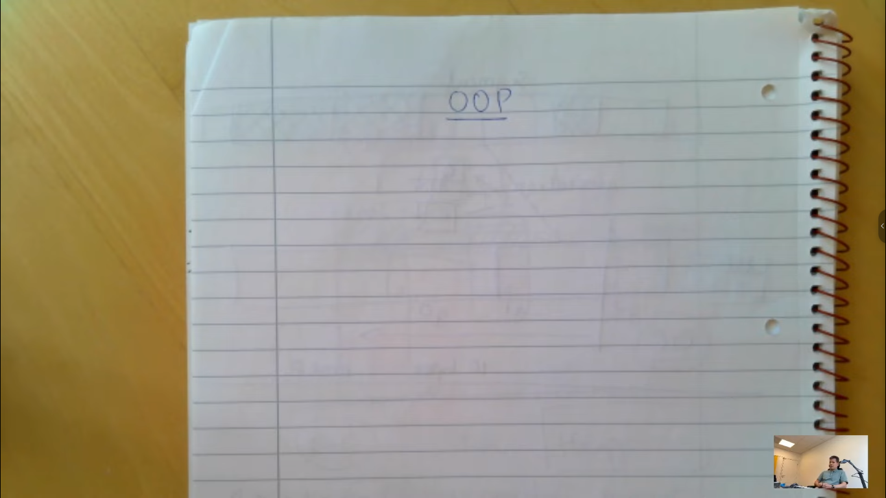

- Trong OOP thì có những tính chất này: đóng gói, thừa kế, đa hình, trừu tượng

---

1. Đóng gói:

- Nó cho phép chúng ta đặt ra các giới hạn về quyền truy cập. Thông thường thì nó 3 cấp độ chính mà tất cả ngôn ngữ
  lập trình hướng đối tượng đều có như là: public, protected, private
  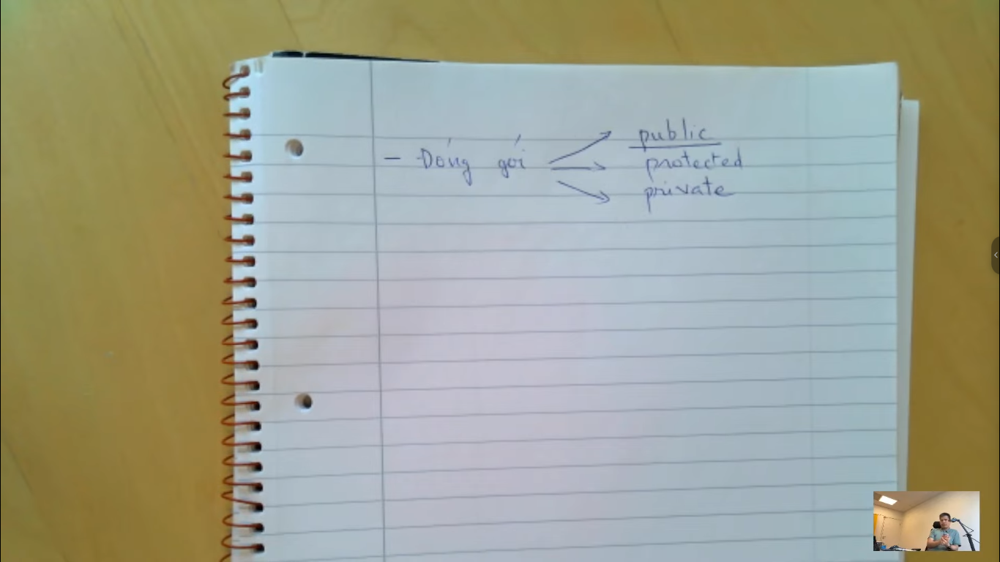

- public: thì nó cho phép truy cập từ bất kể từ đâu và không có bất kỳ giới hạn nào ở trong đó.
- protected: Nếu các bạn đặt ở cấp độ này thì chỉ có những lớp con thừa kế từ lớp chứa các thành phần được khai báo thì
  mới có thể truy cập vào được
- private: chỉ có những thành phần nào thuộc lớp đó và trong cùng lớp đó thì mới có thể truy cập vào được private. Ví dụ
  như là: gán giá trị, đọc giá trị, gọi các hàm từ private

Tóm lại:

- Tính đóng gói này nó giúp cho chúng ta kiểm soát được các thành phần bên ngoài được truy cập vào
- Vì sao các bạn phải kiểm soát các quyền truy cập này? Khi mình kiểm soát các quyền truy cập này thì sẽ giúp cho chúng
  ta giảm bớt các lỗi sai vì cái việc truy cập không đúng từ bên ngoài. Các bạn cũng sẽ giúp cho những người dùng lớp
  của các bạn khi họ truy cập vào thì người ta không cần quan tâm hoặc biết bên trong lớp các bạn làm gì
- Nếu như lớp của các bạn rất phức tạp chẳng hạn như là 100 cái biến,... thì họ sẽ vào trong lớp các bạn kiểm tra xem
  các biến đó để làm cái gì
- Tính đóng gói này thì nó không có liên quan gì đến bảo mật hết. Ai nói tính đóng gói là có liên quan đến bảo mật là
  sai nhé. Bảo mật là những cái công việc nào mà các công việc từ bên ngoài tấn công vào 1 cách chủ ý như là mã
  hóa,...dù cho người ta muốn làm thì đó gọi là bảo mật. Còn OOP nó phục vụ cho ngôn ngữ bật cao, nó phục cho những
  người viết chương trình, nó chỉ có ý nghĩa khi nó còn là mã nguồn thôi --> sau khi nó biên dịch ra rồi thì nó không
  còn là OOP nữa

- Đây là 1 ví dụ được viết từ C++ và được biên dịch ra code Assembly
  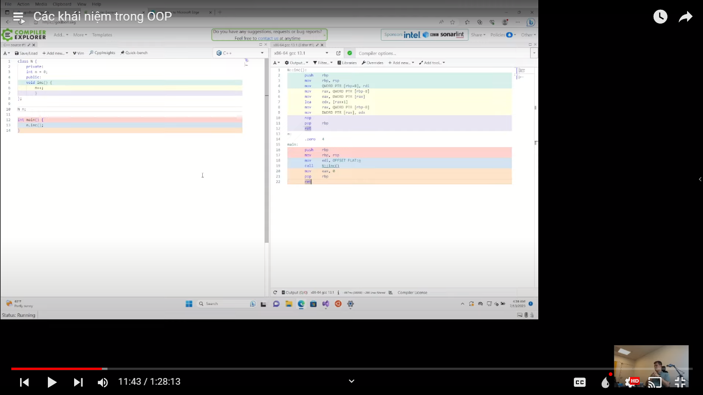

- Ngôn ngữ Assembly nó giống như ngôn ngữ máy, nhưng ngôn ngữ đó dễ nhớ và dễ đọc hơn

> Lưu ý: các khái niệm trong OOP thì không có gì bảo mật hết. Nhiều người mắc sai lầm khi học về OOP

---

- Nếu như các thành phần đó không có ai sử dụng từ bên ngoài thì không nên để public
- Nếu như không có ai sử dụng nó từ các thừa kế thì không nên dùng protected
- Private là ưu tiên hàng đầu. Nếu như không biết đặt tên class đó là cái gì thì các bạn nên đặt private, trừ khi nào
  các lớp con thừa kế từ lớp mà bạn vừa tạo thì nên đặt là protected
- Chỉ có thành phần nào mà các bạn muốn chắc chắn người dùng cần dùng đến thì các bạn để là public

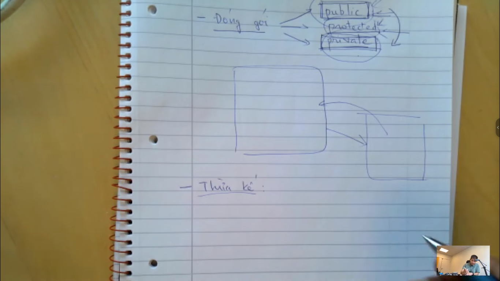

---

2. Thừa kế:

- Thừa kế cho phép chúng ta khai báo class mới thừa kế lại class cha.
- Trong class con thừa kế lại tất cả các thành phần từ class cha, và class con chứa tất cả các thành phần mà class cha
  có
- Khi nào chúng ta dùng thừa kế? và thừa kế mang lợi ích gì? Chúng ta muốn mở rộng thêm class đó bằng cách tạo 1 class
  mới và thừa kế lại lớp đó mà chúng ta muốn phát triển thêm
  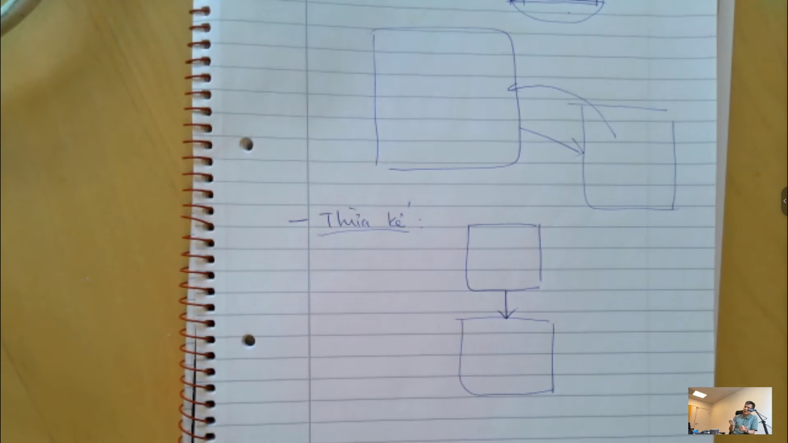
- Ý nghĩa của thừa kế là nó cho phép mở rộng tính năng từ những cái đã có, phải có thừa kế thì chúng ta mới mở rộng từ 1
  cái chúng ta đã có. Hiểu nôm na là chúng ta thêm 1 vài cái mới vào 1 cái đã có (cũ), hơn là tạo 1 cái mới mà đỡ phải
  gõ lại các code của class cũ
  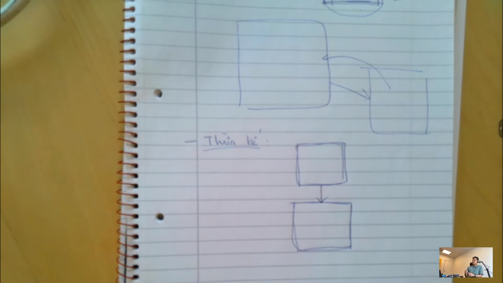

> Khi các bạn học thì các bạn đừng khó hiểu các tính chất của nó. Các bạn nên đọc hết qua lun 1 lần, nếu không hiểu thì
> đọc lại và xem code thêm để hiểu hơn nữa

- Lưu ý: những tính chất đó nó có liên kết với nhau, và liên kết chặt chẻ, như thế nó mới liên kết
- Khi nào chúng ta phải sử dụng thừa kế? Trong nguyên tắc hướng đối tượng thi khuyên các bạn nên dùng thừa kế khi nào
  các bạn thấy cần thiết. Cố gắng dùng thừa kế càng nhiều càng tốt -> để cho code dễ đoạn và clean hơn, chứ đừng nên
  copy code từ file này sang file kia
  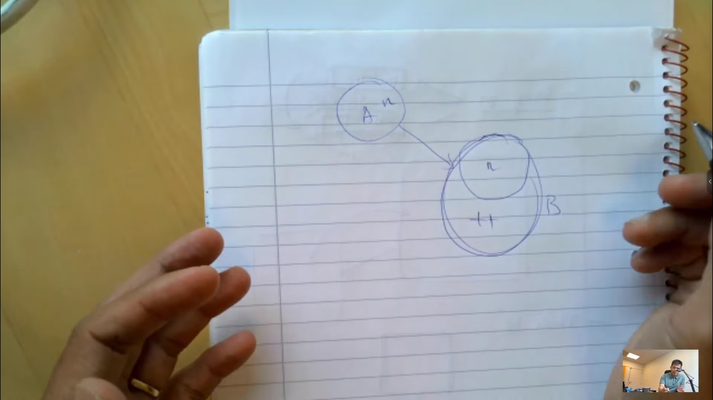
  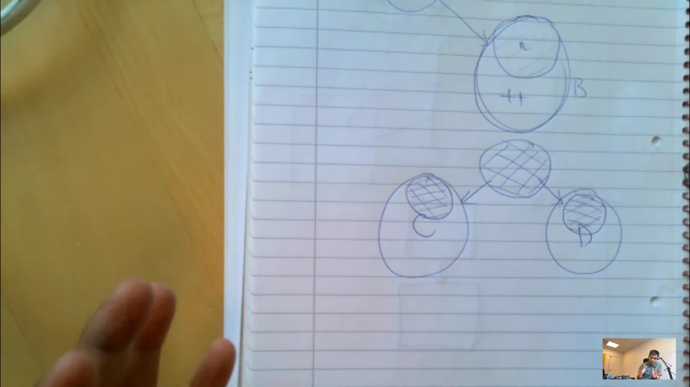

---

3. Đa hình

- Tính chất này là tính chất khó hiểu nhất trong OOP
- Đa hình nó cho phép định nghĩa lại lớp cha (tất nhiên là các bạn có sử dụng thừa kế). Nếu mình có 1 cái tham chiếu đến
  lớp cha đó, khi mình gọi nó sẽ tự biết được lớp con đó. Mà trong ngôn ngữ hướng đối tượng thì gọi là override
  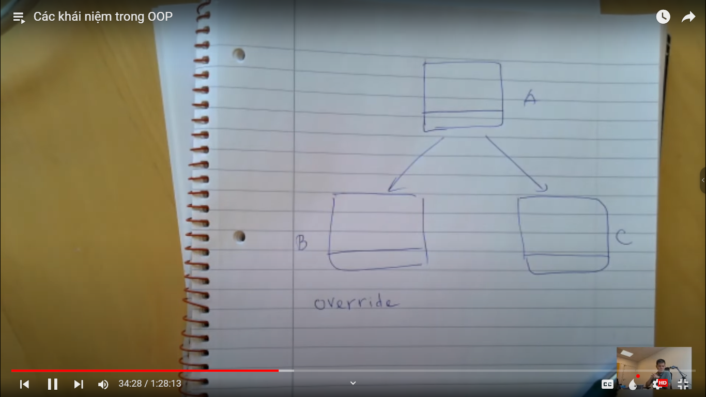

---

- Ví dụ: hệ thống đọ dữ liệu từ 1 nguồn dữ liệu nào đó
- Trong đó các bạn có data source
- data reader -> read
  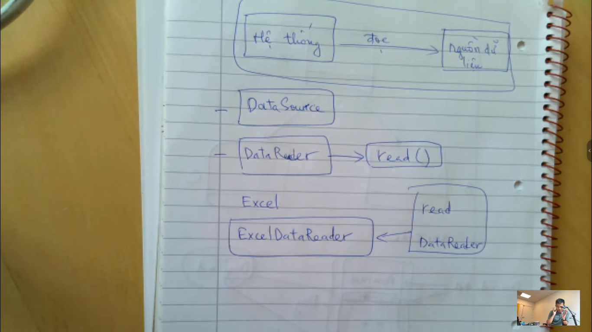
  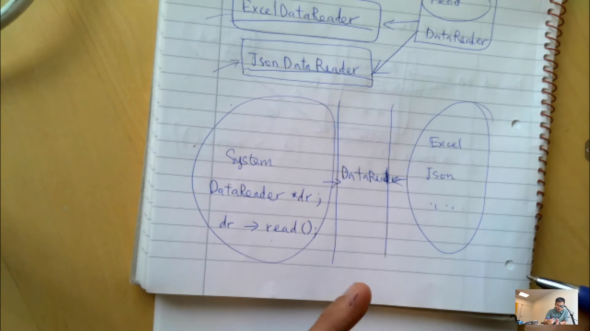
- tính đa hình nó giúp chúng ta mở rộng hệ thống ra
  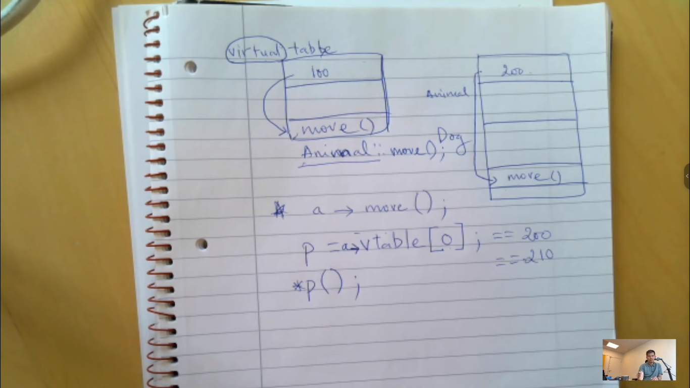