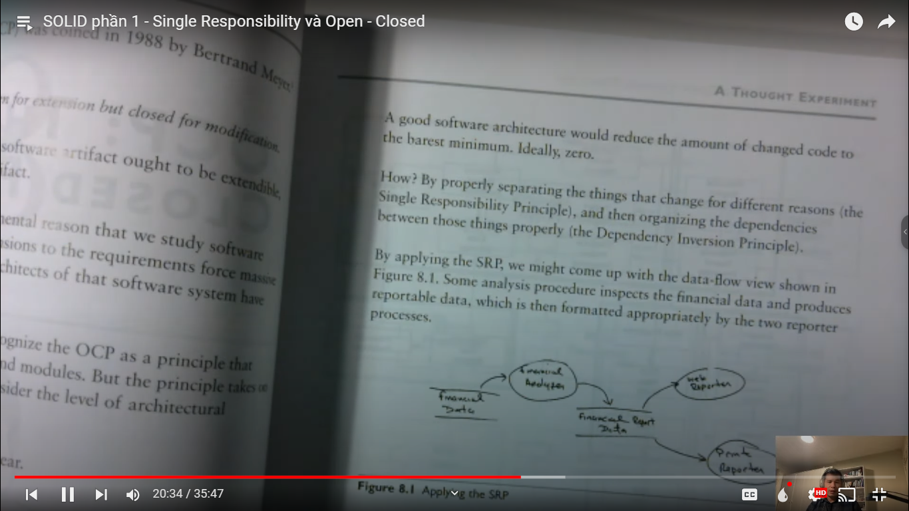

# SOLID là gì? Có cần thiết hay không? Có bắt buộc phải dùng không? Các nguyên tắc trong SOLID là gì?

Trong video này chúng ta học về bài: `SOLID phần 1 - Single Responsibility và Open - Closed`

---

> Trong bài học này chúng ta sẽ học về SOLID trong kỹ sư phần mềm. Khái niệm này các bạn có thể tham khảo trên google
> hoặc youtube (trên mạng rất nhiều). Nếu đọc được tiếng anh thì các bạn có thể đọc cuốn `Clean Architecture`

---

## Nguyên tắc thứ 1: Single Responsibility

- Nguyên tắc này có nghĩa là khi mình làm 1 chức năng để phục vụ cho người dùng nào đó, thì cái chức năng đó sẽ bị ảnh
  hưởng bởi người dùng đó
- Có nghĩa là chức năng đó phụ thuộc vào người dùng đó. Khi họ muốn chức năng đó hoạt động như thế nào thì chức năng của
  các bạn nó sẽ phải thay đổi để phục vụ cho người dùng đó (hiểu nôm na nó là như vậy)
- Khi cấu trúc bên trong của tổ chức đó mà nó thay đổi thì cấu trúc bên trong hệ thống của các bạn cũng sẽ thay đổi theo

> - Quy tắc đầu tiên nó muốn nhắc cho chúng ta tách biệt các chức năng cho mỗi nhóm người dùng ra. Chúng ta đừng có dùng
    > chung cho mỗi cái module nào đó cho 2 nhóm người dùng khác nhau. Trong ngôn ngữ thiết kế thì ta dùng kí
    hiệu `Actor`.
    > Đừng bao giờ gom các việc của các role khác nhau vào chung 1 module. Mỗi module nên phục vụ mỗi nhóm thôi.
> - Bởi vì có thể trong thời điểm đó các bạn viết code có thể yêu cầu nó giống nhau, nhưng đó là 2 nhóm khác nhau, trong
    tương lai nó cũng có yêu cầu khác nhau. Nếu như nhóm này nó có yêu cầu thay đổi chức năng nào đó thì sẽ làm bị ảnh
    hưởng đến các nhóm còn lại

- Nó có thể dẫn đến 2 cái vấn đề:

    - Thứ 1: khi các bạn dùng chung như vậy thì nếu như các bạn sửa đổi chức năng cho mỗi actor thì nó ảnh hưởng đến
      actor còn lại mà các bạn không thể nào biết trước được. Có thể người viết ra module đó là bạn hoặc là 1 người nào
      đó, mà bạn là người đi sửa cái module đó, mà bạn không hề biết rằng module đó còn sử dụng cho 1 actor khác. Đến
      khi chạy thì mới phát hiện ra là lỗi
      
        - Có 1 bảng Employee, có 3 người sử dụng. Khi ông CFO muốn sửa đổi trường calculatePay thì nó sẽ ảnh hưởng đến
          ông COO và CTO, bởi vì 3 ông cùng sử dụng 1 module nên 1 ông sửa thì sẽ bị ảnh hưởng đến 2 ông còn lại.
        - Cách khắc phục:
          
        - Các chức năng tách thành các lớp riêng. Khi mà ta sửa đổi trong đó thì nó sẽ không bị ảnh hưởng đến 2 lớp đó
    - Thứ 2: Khi mình dùng chung như vậy thì dẫn đến 2 nhóm khác nhau làm việc trên cùng 1 lớp thì sẽ bị xung đột khi
      code chung với nhau. Tức là nhóm A sửa 1 số chỗ, nhóm B sửa 1 số chỗ -> dẫn đến trục trặc
      
      

---

## Nguyên tắc thứ 2: The Open-Close Principle

- Những cái môn mà phân tích thiết kế nó có 1 cái khó là: mình không thể nhìn thấy kết quả ngay lập tức. Các vấn đề đôi
  khi nó không hoàn toàn đúng và cũng không hoàn toàn sai. Nếu mình nhìn theo gốc độ này thì đúng, nhìn theo gốc độ khác
  thì không đúng.
- Vậy tại sao mà các chuyên gia về kiến trúc phần mềm, họ làm việc chung rất lâu với nhau thì họ cũng có thể chửi nhau
  thì đó cũng là chuyện bình thường
- Đổi khi giải thích ra thì nó hơi khó. Khi học về phân tích thiết kế thì học và đọc rất nhiều. Các bạn nên nắm về các
  nguyên lý và các gốc nhìn khác nhau thì có thể hiểu được các vấn đề
  

---

- Vậy thì Open/Close là gì?

> Thì khi 1 phần mềm chạy thì nó phải mở -> để có thể mở rộng. Và close -> là mình phải chỉnh sửa. Tức là chúng ta phải
> thiết kế như thế nào để có thể vừa mở rộng và không cần chỉnh sửa, nhưng nó cho phép chúng ta mở rộng ra để ta thêm
> chức
> năng và chỉnh sửa --> Đó gọi là mở rộng tính năng

- Các bạn đi làm thì có thể hiểu điều này: khi chúng ta chỉnh sửa 1 cái gì đó nó khó hơn nhiều so với viết cái mới. Thì
  chúng ta thà viết cái mới từ đầu nó còn dễ hơn phải chỉnh sửa cái cũ
  

- Phần mềm của bạn nếu như được thiết kế với Open/Close thì sau này sẽ dễ dàng hơn cho việc phát triển
  

---

- Khi chúng ta nói đến phương pháp này thì chúng ta dùng từ `module` thì sẽ hợp lí hơn dùng từ `class`. Vì class nó chỉ
  là 1 hình thức cụ thể mà 5 cái phương pháp này hỗ trợ thôi
- Khi chúng ta nói đến 1 phần mềm có thể dễ dàng mở rộng và dễ chỉnh sửa thì đó là 1 ước muốn của người làm phần mềm
- Ai cũng muốn như vậy thì có thể làm như thế nào? 1 cái module mà ôm đồm quá nhiều chức năng thì có thể nó rất khó để
  mở rộng
  

- Vì sao người ta thiết ra CPU riêng, mainboard riêng,...thành từng phần nhỏ. Đó là họ làm như vậy để có thể dễ dàng
  nâng cấp
  từng phần riêng
- Nếu như 1 module có quá nhiều feature thì nó khó mở rộng. Và nó sẽ bị phụ thuộc vào 1 cái implementation cụ thể nào
  đó. Bởi vì lúc nào cũng bị phụ thuộc vào cái đó

---

- Vậy nếu muốn có thể mở rộng module 1 cách dễ dàng thì làm như sau:

- Mỗi 1 class thì làm 1 chức năng cụ thể
- Ví dụ viết 1 chương trình được lấy dữ liệu từ API: thì các bạn phải tách ra từng phần nhỏ. Chứ nếu như các bạn viết 1
  đống code vào đó thì đến 1 ngày API người ta bị thay đổi thì các bạn phải chỉnh sửa các syntax đó thì rất nhọc
- Chúng ta nên làm 1 class để lấy dữ liệu, 1 class để định dạng dữ liệu, 1 class lưu vào database, thì nó sẽ dễ dàng
  viết và mở rộng hơn rất nhiều

---

- Thật ra cái việc không phụ thuộc vào 1 class cụ thể thì nó liên quan đến nguyên tắc thứ 5 trong SOLID đó là The
  Dependency Inversion Principle (Trong video thứ 2)
  

---

- Như vậy là trong clip đầu tiên này thì chúng ta nói về:
- Single Responsibility: mỗi 1 module thì phụ thuộc vào 1 và chỉ 1 actor. Nếu class chúng ta phụ thuộc vào nhiều actor
  thì phải đưa các chức năng mà nó liên quan đến actor khác vào implement khác
- Open/Close: 1 module thì cho phép mở rộng, nhưng không cho phép chỉnh sửa. Thì ta phải làm 2 việc:
    - Là tách nó ra và mỗi lớp thực hiện mỗi chức năng
    - Chúng ta phải sẽ phải cho các class hoặc module đó giao tiếp với nhau thông qua tầng trừu tượng như interface,
      interface nó đóng vai trò cam kết về cái gì đó, về class cung cấp những tính năng này