# Liskov Substitution, Interface Segregation và Dependency Inversion Principle

Trong video này chúng ta học về 3 nguyên tắc còn lại trong 5 nguyên tắc SOLID

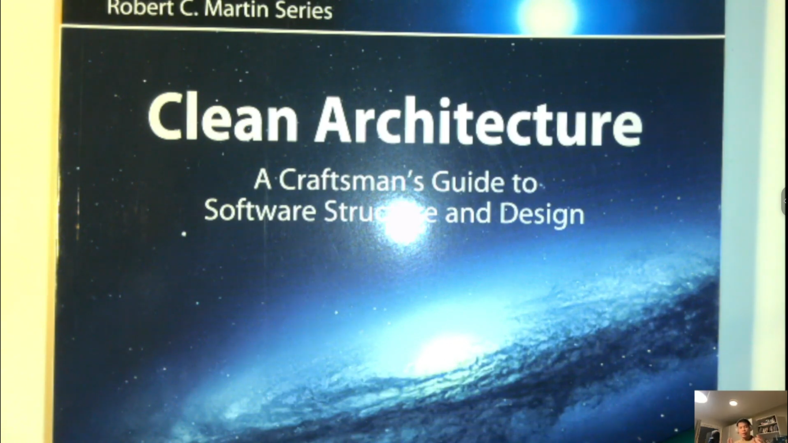

---

- Tóm tắt lại chút kiến thức cũ về 2 phần đó:

- Single Reposibility: là 1 cái nguyên tắc mà nó nói rằng 1 module thì nó chỉ phục vụ cho 1 actor. Hai actor khác nhau
  thì nó có 2 yêu cầu khác nhau, hoặc 2 yêu cầu hệ thống khác nhau. Chúng ta viết 2 cái module dùng chung thì trong
  tương lai sẽ xảy ra vấn đề như: 1 trong cái actor thay đổi yêu cầu và khi ta thay đổi theo yêu cầu mới đó. Vì ta dùng
  chung như vậy thì vô tình chung nó cũng thay đổi những thứ bên actor kia những thứ không mong muốn. Chúng ta sẽ không
  nhận ra cho đến khi chạy hệ thống, dẫn đến 2 team khác nhau khi merge code sẽ gây ra nhiều khó khăn
- Open/Close: tính chất này nó yêu cầu chúng ta thiết kế các module sao cho dễ dàng mở rộng và hạn chế việc thay đổi. Để
  làm những việc này thì chúng ta phải thiết kế các module sao cho nó phục vụ 1 tính năng duy nhất. Và thứ đầu vào đầu
  ra,...những thứ phụ thuộc vào module của chúng ta nó chỉ phụ thuộc vào ràng buộc, contract. Chúng ta không nên thiết
  kế các module dựa trên các implementation của hàm.
- Trong các ngôn ngữ lập trình như C# chúng ta dựa trên các interface, chúng ta không nên dùng các implementation. Do đó
  chúng ta dễ ghép nối các module lại với nhau
- Các module đó giao tiếp với nhau qua contract

---

## Nguyên tắc thứ 3: Liskov Substitution

- Nguyên tắc này chủ yếu nói về thừa kế, cái chữ `Liskov` nó chỉ là cái tên riêng nên các bạn không cần phải tra từ điển
- Nguyên tắc này nó hướng dẫn cho chúng ta tạo ra các lớp thừa kế.
- Nguyên tắc này nó bày ta thiết kế module như thế nào để có thể thay thế cái lớp con vào vị trí của đối tượng của lớp
  cha và không làm cho logic chương trình thay đổi
- Hiểu nôm na như thế này: Khi ta có 1 lớp B thừa kế lớp A thì khi có 1 object B đưa vào object A thì ta không cần phải
  sửa đổi chương trình của nó. Chủ đề này nói thì hơi khó hiểu, các bạn nên tìm thêm ví dụ để dễ hình dung hơn
- Ví dụ:
  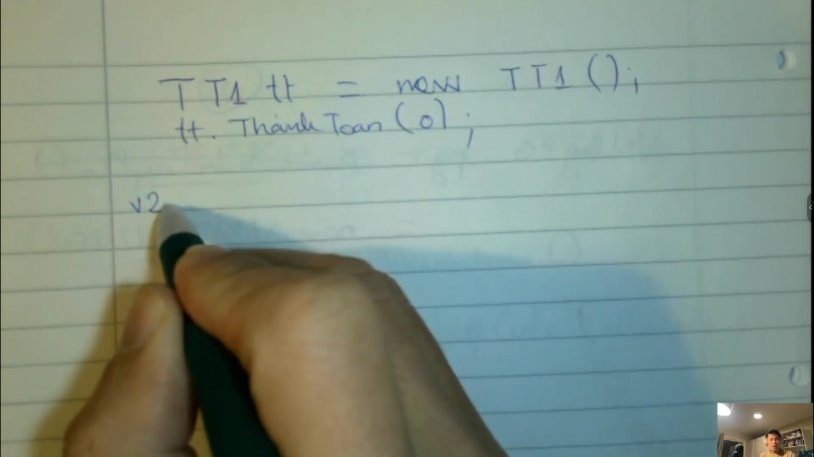

- Chúng ta tạo class TT2 thừa kế từ TT1 và có thêm phương thức nạp code. Thì chúng ta phải gọi phương thức nạp code
  trước rồi mới chạy các logic khác
  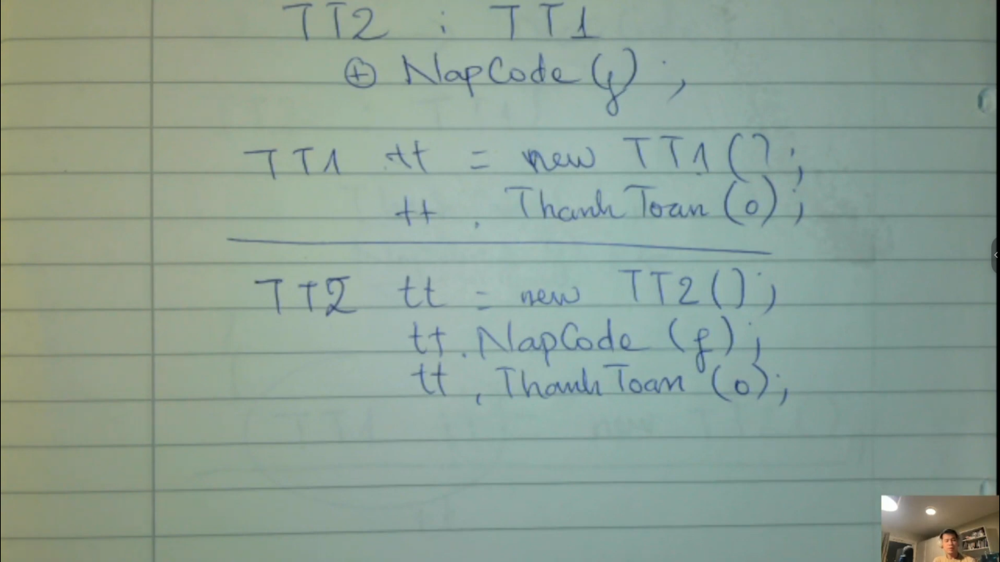
  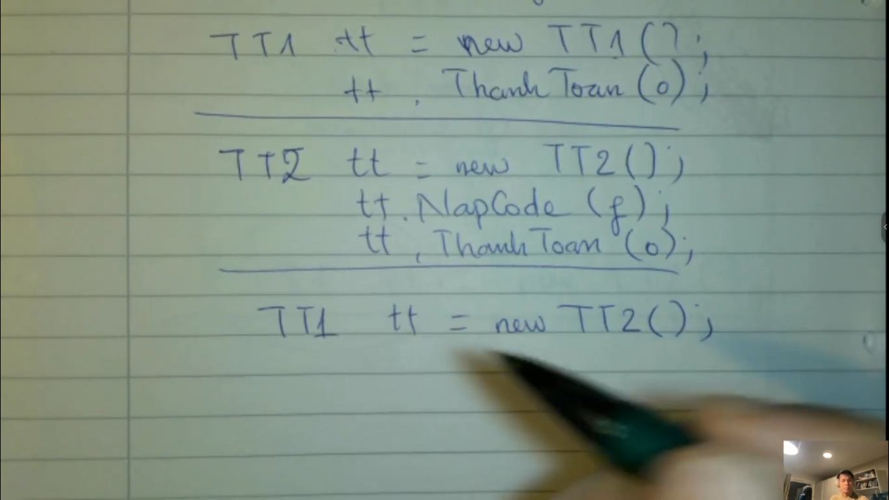
  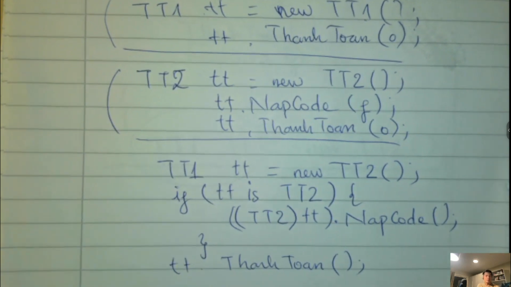
- Khi chúng thiết kế như thế này thì chúng ta chỉ nghĩ đến hiện tại thôi chứ không phải tính xa cho tương lai. Như vậy
  là thiết kế không được như ý lắm
  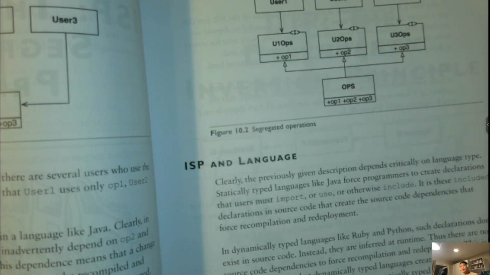

---

## Nguyên tắc thứ 4: Interface Segregation

- Chúng ta sẽ lấy 1 ví dụ trong C#
  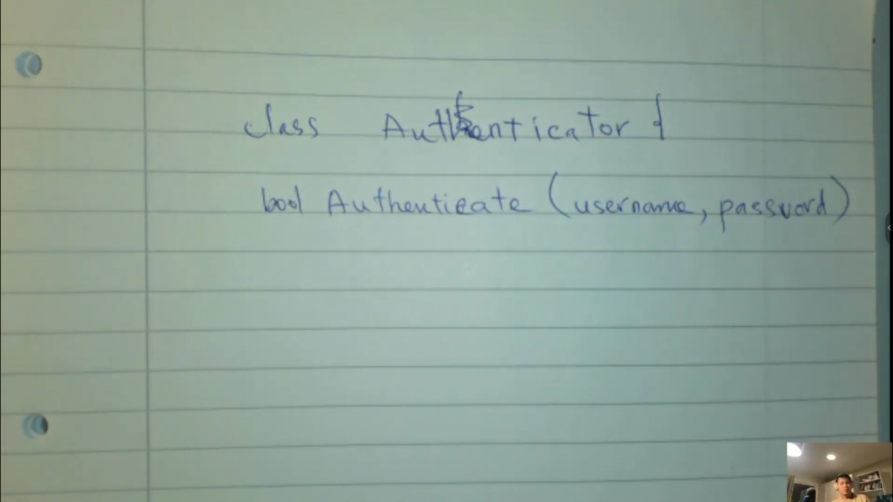
- Chúng ta có 1 hàm, nó sẽ truy cập vào database để lấy usernam và password
  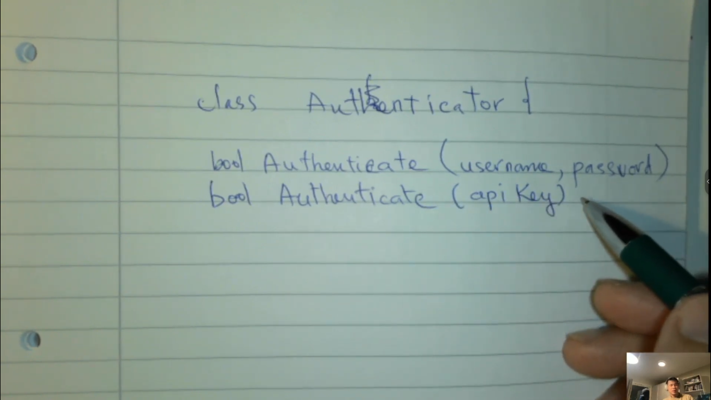
- Và hàm này lấy 1 cái apiKey để truy cập vào api để lấy api và nó sẽ trả về
- Nó sẽ dùng Entity Framework để có thể truy cập vào SQL Server
  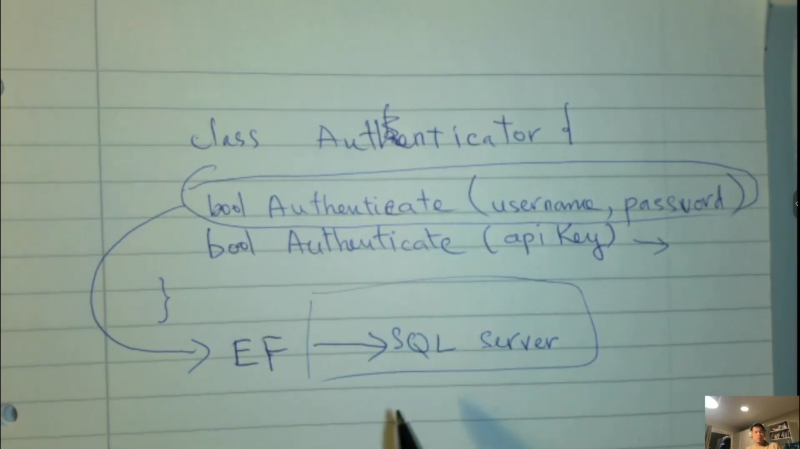
- Đây là chúng ta phụ thuộc vào framework Entity và nó phụ thuộc vào tiếp HTTP Client
  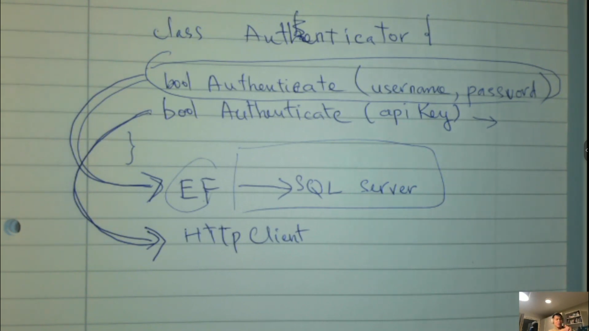

- Chúng ta đang cho phép class Authenticator để cho user lấy username và password để có thể trả về API
  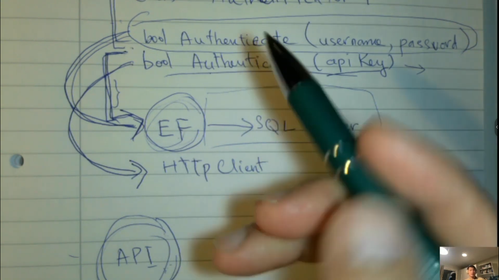

---

> Các vấn đề này nó phụ thuộc vào trong khi thiết kế, vì khi thiết kế thì sẽ hướng đến tương lai chứ không phải hiện tại

> Nếu các bạn xem không hiểu thì hãy xem lại, thậm chí là làm 1 cái project lớn mất cở 4 5 tháng thì mới có thể thấy
> được
---

## Nguyên tắc thứ 5: Dependency Inversion Principle

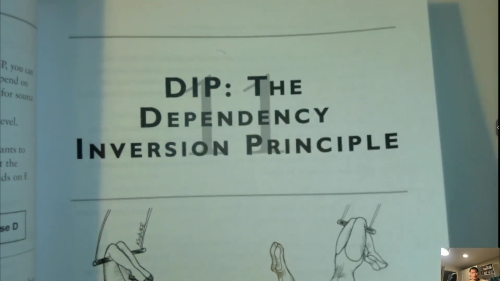

- Nguyên tắc này thì nó không có gì khó hiểu. Các bạn phải hiểu nó thì mới có thể học tiếp được clean architecture được.
  Vì nó dựa trên nguyên tắc này

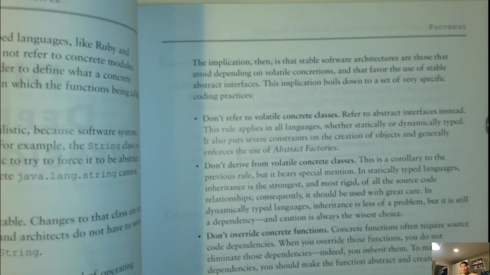

- Nguyên tắc này nó nói về module đừng bao giờ phụ thuộc vào implement cụ thể, các bạn chỉ phụ thuộc vào các interface,
  contract thôi.
- Giả sử mình có client connection, nó sẽ chịu trách nhiệm đọc các request và nó sẽ trả về response
  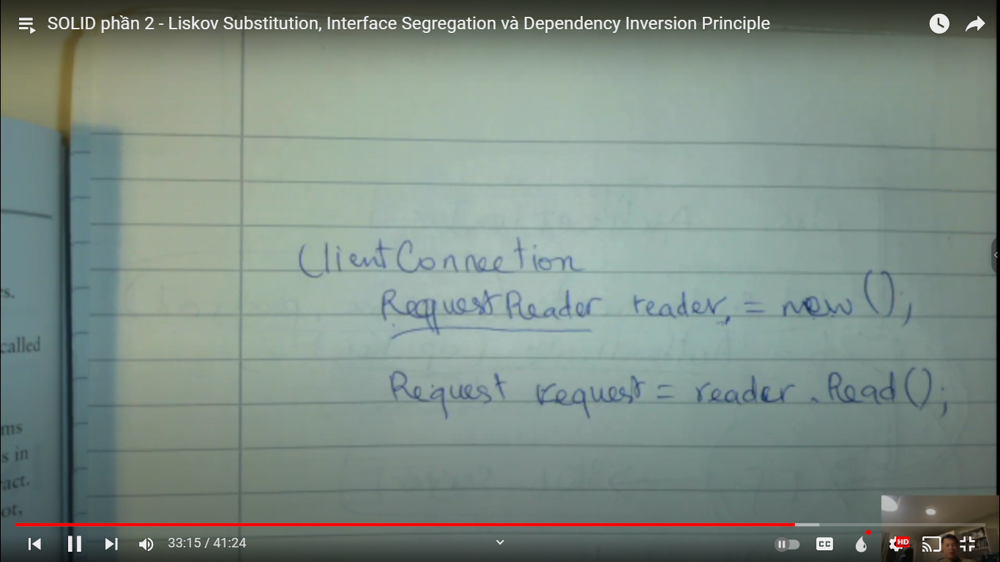
- Đó là bản mà chúng ta mô phỏng nhanh và sau đó chúng ta phải tối ưu lại và truyền tham số cho nó
  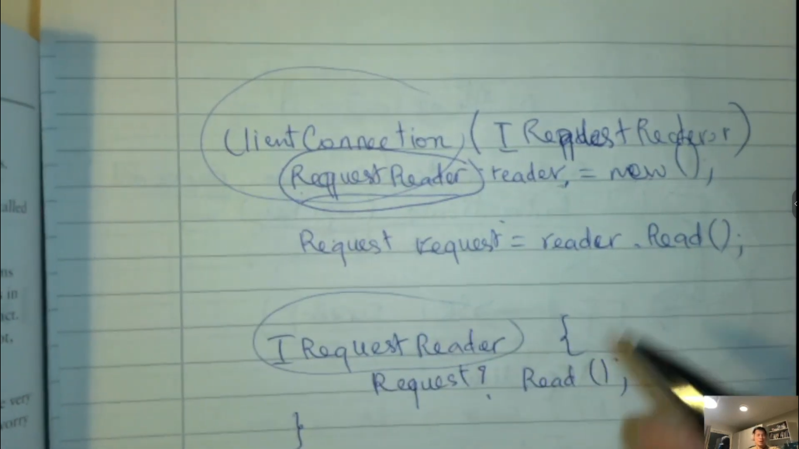
- Thì cái ClientConnection nó sẽ phụ thuộc vào IRequestReader thôi

---

- Vì vậy khi các bạn thiết kế các lớp cũng vậy. Các bạn nên cho các module phụ thuộc vào interface thôi, đừng phụ thuộc
  vào các implementation cụ thể, đặc biệt là những cái class trong tương lai có thể thay đổi
- Chỉ có 1 số trường hợp chúng ta dùng các implement cụ thể, do mấy lớp đó đã được người ta thiết kế rất là kĩ, người ta
  sẽ không bao giờ thay đổi, người ta có thể thêm mới chứ không bao giờ thay đổi
- Như class IString thì chúng ta không phải thay đổi cái gì nữa,, bởi vì nó quá hoàn hảo rồi, chúng ta không phải thay
  đổi class nó nữa
  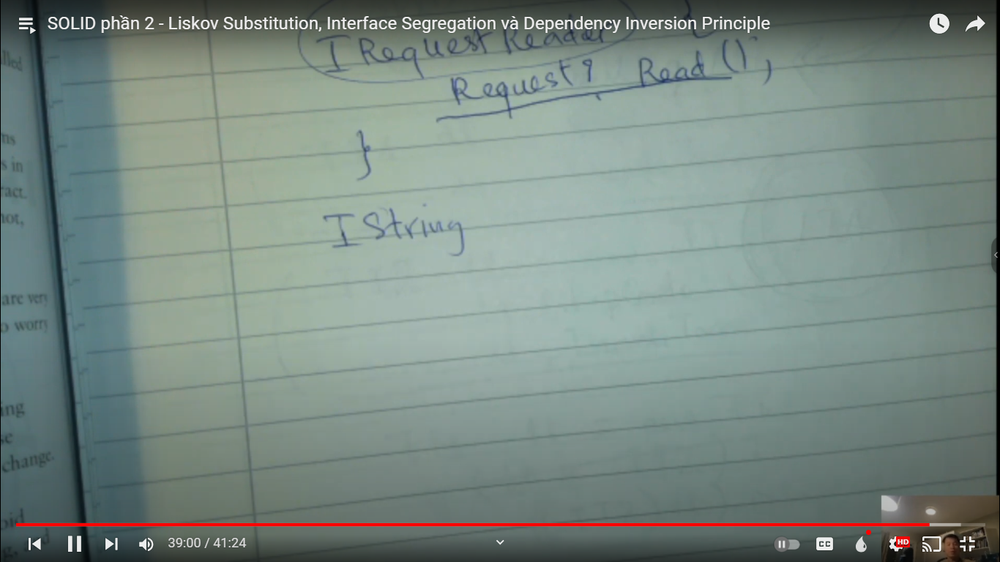

---

> Vậy là chúng ta đã xong 5 nguyên tắc SOLID. Các bạn cần phải hiểu 5 nguyên tắc này thì mới có thể nắm được kiến thức
> Clean Architecture

> Các bạn nên xem nhiều, đọc nhiều hoặc có thể làm dự án dài hơi, thì mới có thể nhìn thấy vấn đề